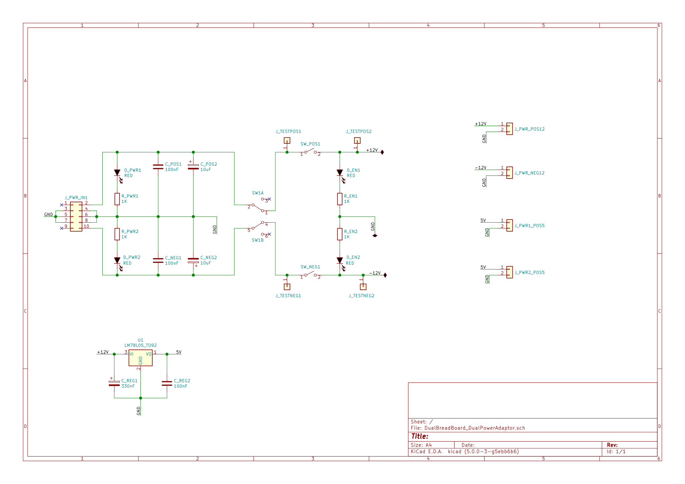
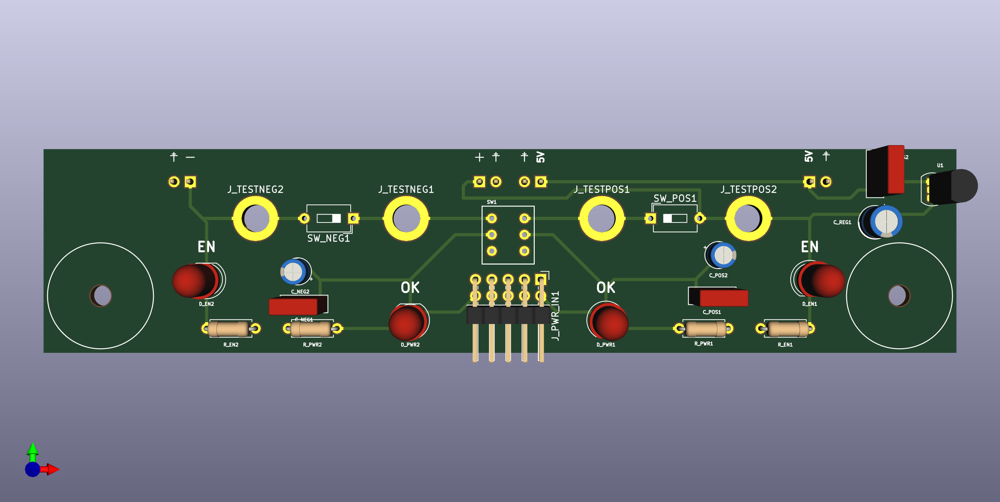
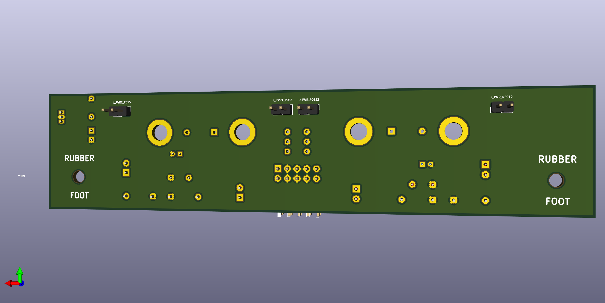
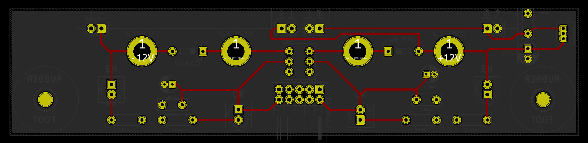
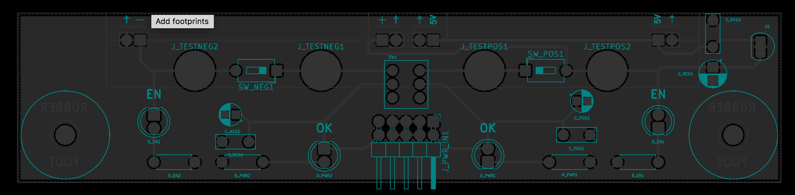

<h2> IDC connector breadboard power adaptor </h2>

This design takes a bipolar input power source using a 10-pin (02x05) IDC connector, and allows easy attachment to two 830-point breadboards, attached side-by-side. 
 
Power can be disconnected from the breadboard without physically removing the adaptor. LEDs indicate the power input/output status. 

<h3>Schematic</h3>

<h3>3D Render</h3>

<h3>Layout</h3>

