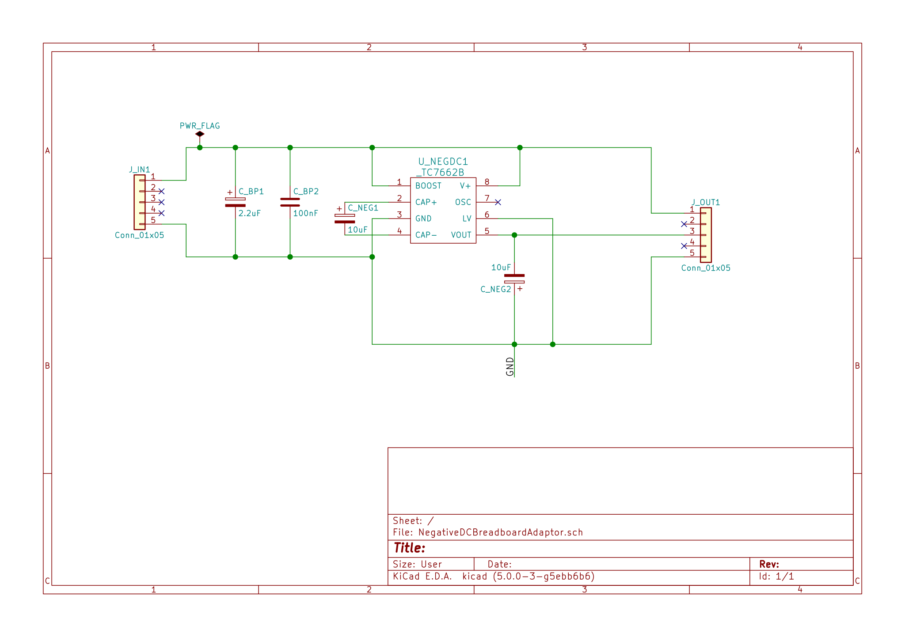
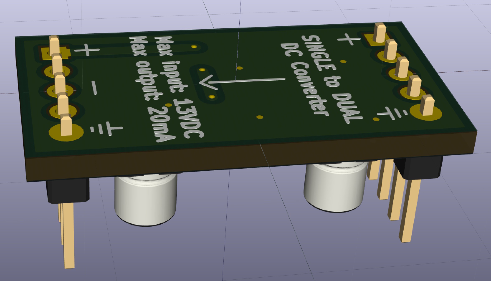
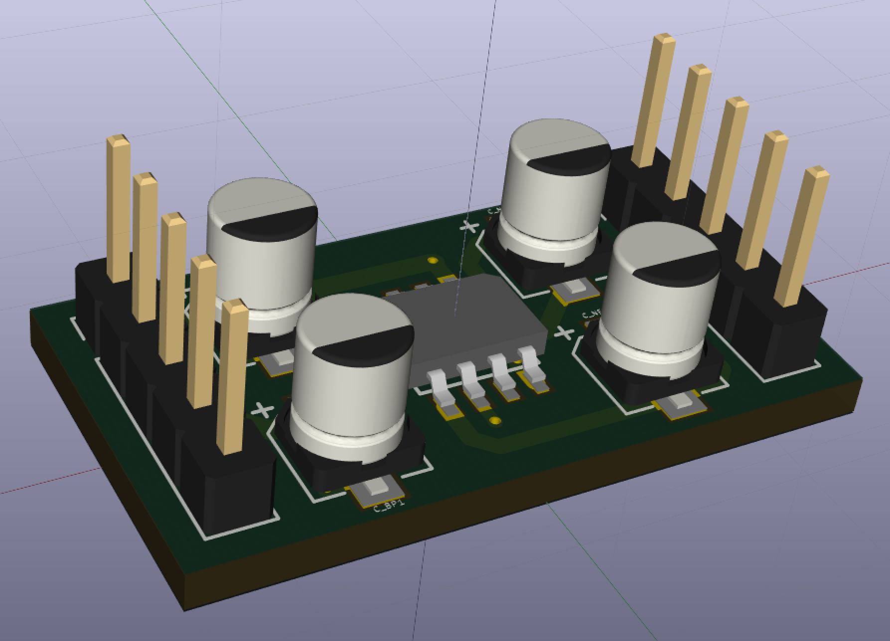
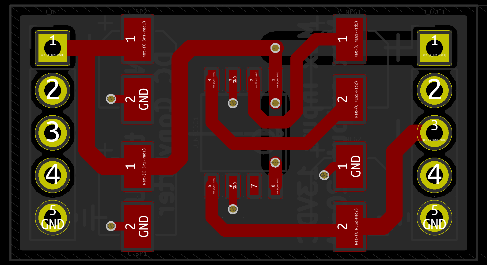
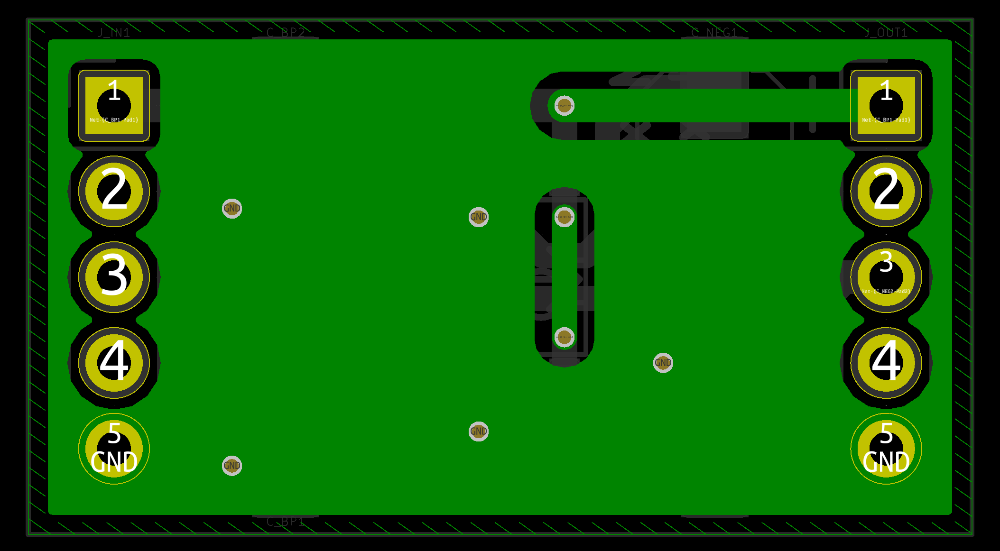

<h2> Low current TC7660S-based Bipolar Regulator </h2>

Designed to sit over central divide on a breadboard. For development purpose only.
  
Uses charge pump DC-DC converter ([TC7660S](http://ww1.microchip.com/downloads/en/DeviceDoc/20001467C.pdf)) to create negative voltage. 
  Maximum current draw of 50mA is recommended - although the datasheet is vague in explicitly stating absolute maximum limits. 
  
Switching frequency raised to 45 kHz to prevent audible noise. 

<h3>Schematic</h3>

<h3>3D Renders</h3>

<h3> Board Layout</h3>

