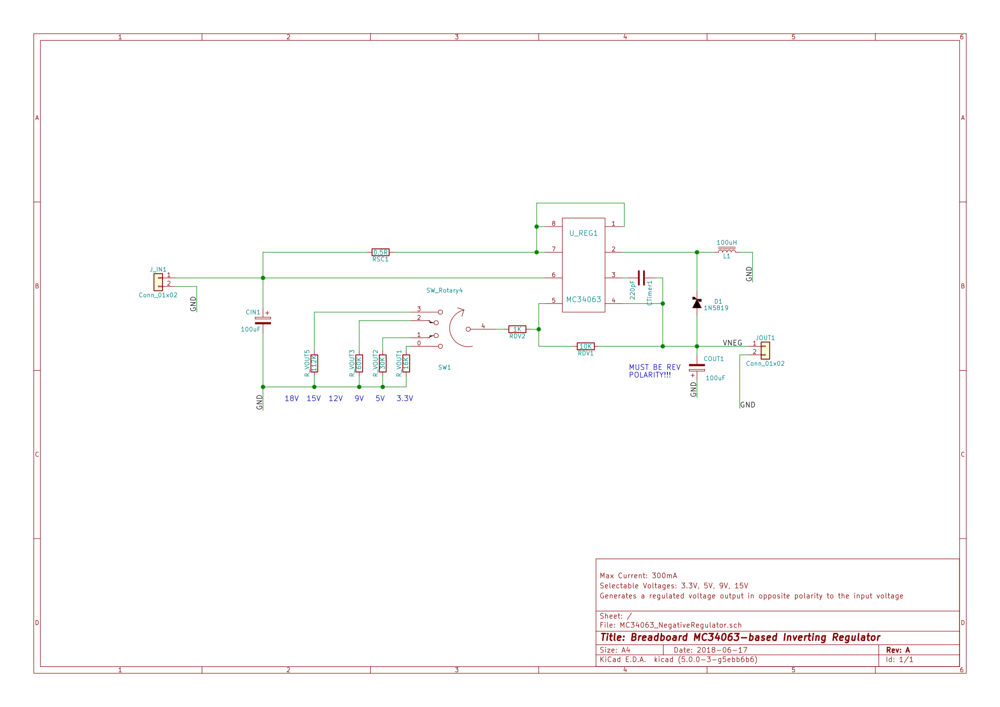
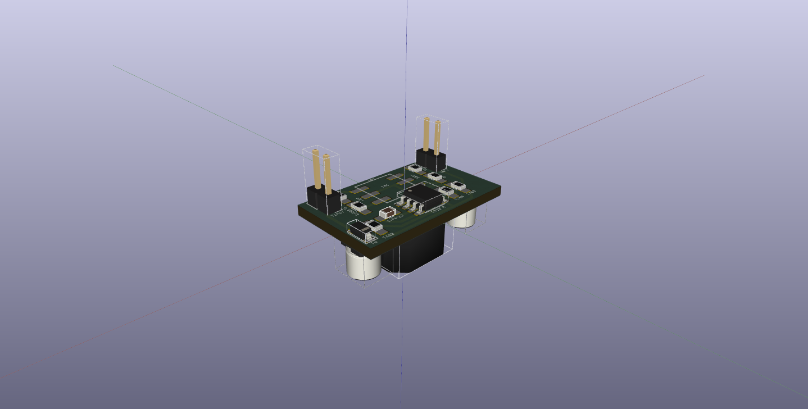
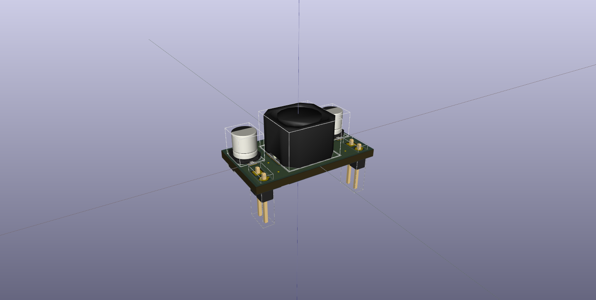
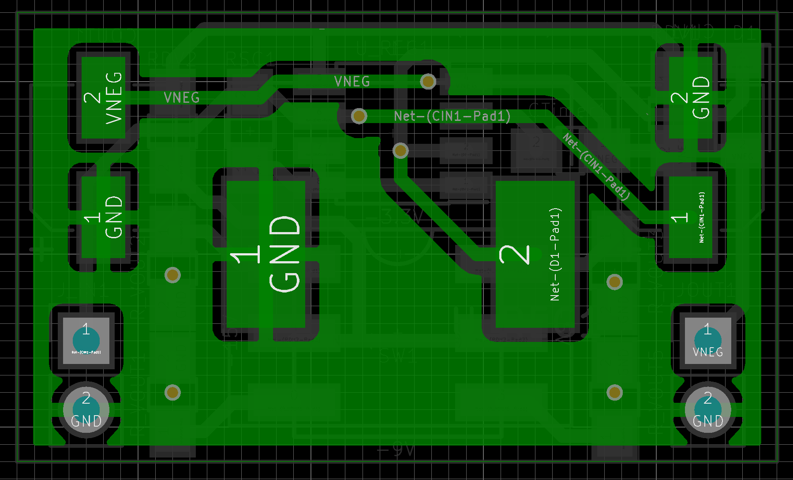
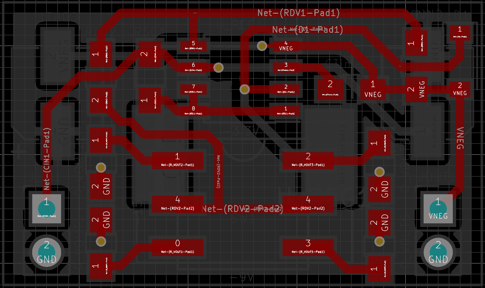

<h2> MC34063-based Negative Regulator </h2>

Simple breadboard adaptor using DC-DC converter ([MC34063](https://www.onsemi.com/pub/Collateral/MC34063A-D.PDF)).
  
Requires inductor but has higher current capabilities than TC7660S-based circuits.
  
Output voltage is selectable using rotary switch on bottom side.

<h3>Schematic</h3>

<h3>3D Renders</h3>

<h3> Board Layout</h3>

